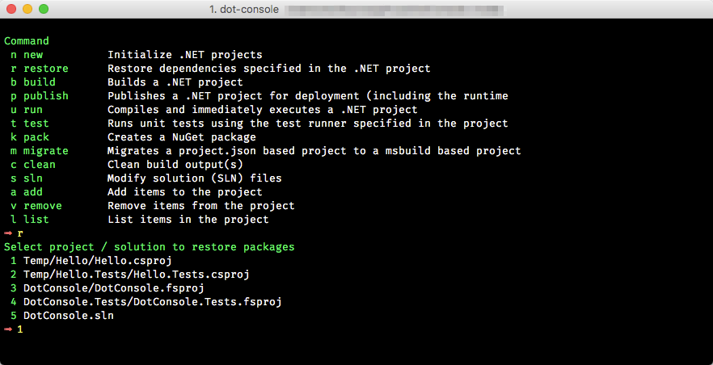

## Interactive Console for .NET Core command-line

[](https://travis-ci.org/wk-j/dot-console)



## Installation

```bash
npm install -g dot-console
```

## Usage

Start console 

```bash
dot-console
```

Exit `CTRL + c`